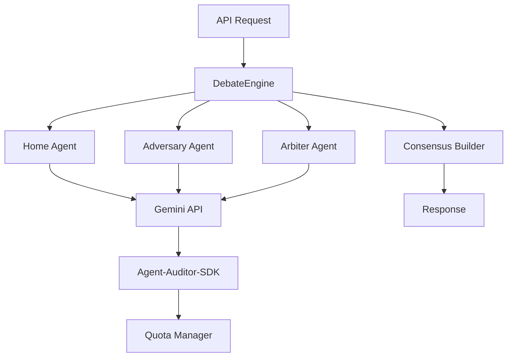

# Meta-Oracle Architecture

> Agent context artifact for understanding the AI Council structure.

## Purpose

AI Council orchestrator for meta predictions and tactical reasoning. Implements structured debates between specialized agents to predict tabletop outcomes.

## Technology Stack

- **Language**: Python 3.11+
- **Async**: asyncio with structured concurrency
- **AI**: Gemini API via Agent-Auditor-SDK
- **Validation**: Pydantic models
- **Testing**: Pytest + async fixtures

## Directory Structure

```
├── src/meta_oracle/
│   ├── agents/         # Council agent implementations
│   │   ├── home.py     # Home-advantage specialist
│   │   ├── adversary.py # Devil's advocate
│   │   └── arbiter.py  # Consensus builder
│   ├── engine/         # Debate orchestration
│   │   ├── debate.py   # DebateEngine core
│   │   └── consensus.py # Vote aggregation
│   ├── graders/        # List evaluation
│   └── models/         # Domain models
├── tests/
└── docs/
```

## Component Graph



## Debate Protocol

1. **Opening** - Each agent states initial position
2. **Rebuttal** - Agents respond to opposing views
3. **Synthesis** - Arbiter proposes consensus
4. **Vote** - All agents vote on final position

## Integration Points

| Consumer     | Method        | Notes            |
| ------------ | ------------- | ---------------- |
| Vindicta-API | REST endpoint | `/api/debate`    |
| List Grader  | Internal call | `grade_list()`   |
| Primordia-AI | Data exchange | Heuristic inputs |
