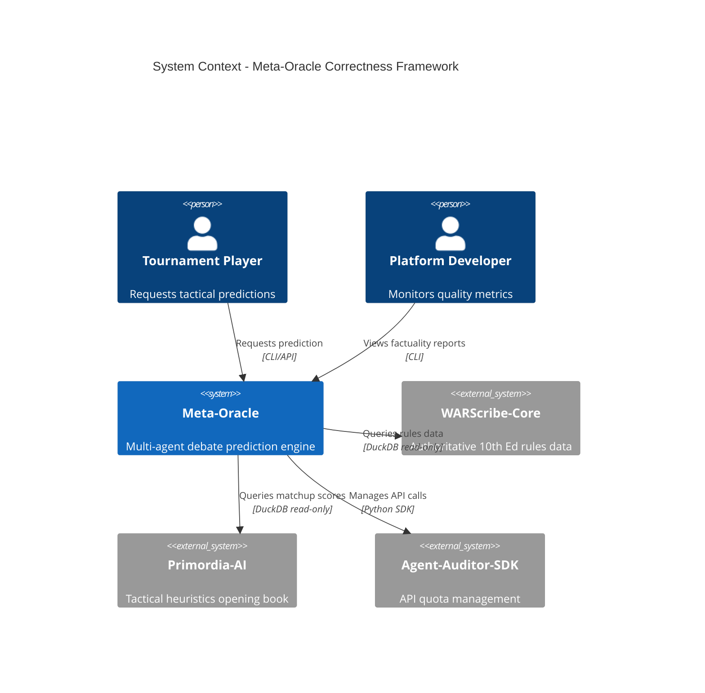
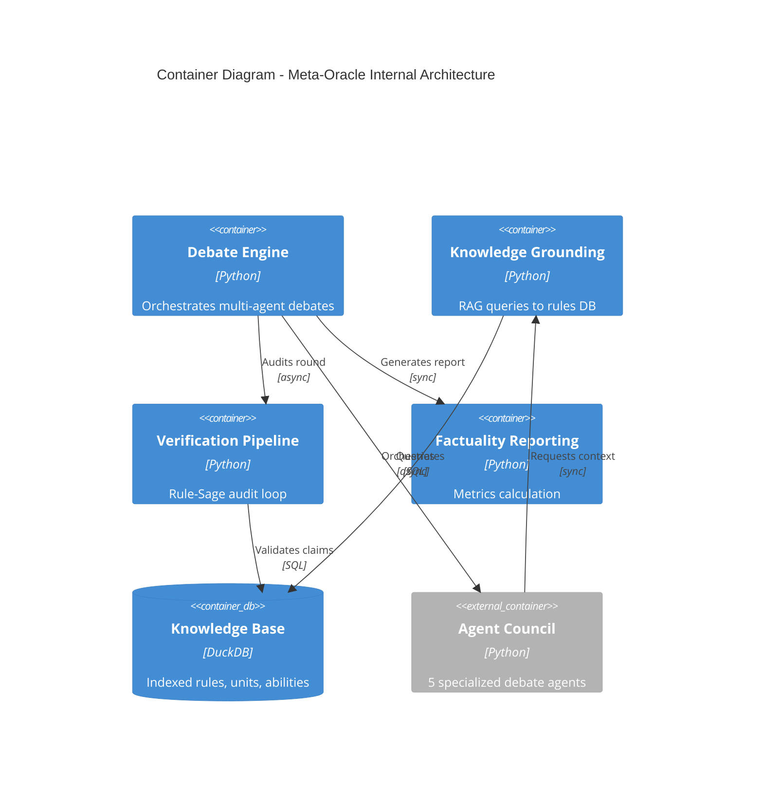
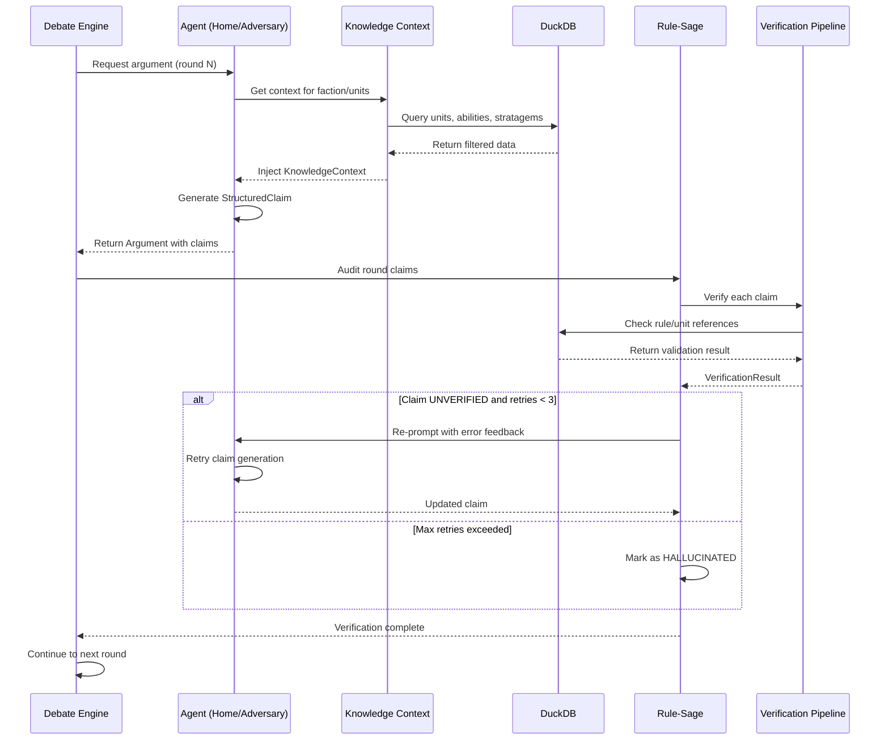

# Design Document: Meta-Oracle Output Quality & Correctness

## Overview

This design document specifies the implementation of a Correctness Framework for the Meta-Oracle prediction engine. The framework transforms the system from producing speculative predictions into a trustworthy, rules-verified prediction engine for competitive Warhammer 40,000.

### Problem Statement

The current Meta-Oracle implementation suffers from:
- Hallucinated unit stats and abilities with no grounding in actual game rules
- Unstructured agent outputs that cannot be automatically verified
- No mechanism to measure prediction accuracy or factuality
- Lack of integration with authoritative rules data sources

### Solution Approach

The Correctness Framework introduces four key layers:

1. **Knowledge Grounding Layer**: Connects agents to verified rules data from WARScribe-Core via DuckDB
2. **Structured Claims System**: Enforces machine-parseable outputs with explicit rule references
3. **Verification Pipeline**: Implements Rule-Sage audit loop with iterative correction
4. **Measurement & Reporting**: Calculates factuality scores and tracks prediction accuracy

### Design Principles

- **Read-Only Integration**: All WARScribe-Core interactions are read-only; Meta-Oracle never modifies source data
- **Async-First**: All I/O operations use async/await patterns for scalability
- **Zero Standing Cost**: Operates within GCP Free Tier limits via Agent-Auditor-SDK quota management
- **Fail-Safe Degradation**: System continues operation when data is missing or ambiguous
- **Testability**: All components designed for property-based testing with clear invariants

## Architecture

### System Context



### Container Architecture



### Component Interaction Flow



## Components and Interfaces

### 1. Knowledge Grounding Layer

#### KnowledgeIndexer

Responsible for ETL from WARScribe-Core data into DuckDB.

```python
class KnowledgeIndexer:
    """Indexes WARScribe-Core rules data into DuckDB knowledge base."""
    
    def __init__(self, db_path: Path):
        self.db_path = db_path
        self.conn: duckdb.DuckDBPyConnection | None = None
    
    async def index_from_warscribe(
        self,
        source_path: Path,
        edition: str = "10th"
    ) -> IndexResult:
        """
        Index rules data from WARScribe-Core export.
        
        Args:
            source_path: Path to WARScribe-Core data directory
            edition: Game edition to index (default "10th")
            
        Returns:
            IndexResult with counts of indexed entities
        """
        ...
    
    async def _index_units(self, data: dict) -> int:
        """Index unit datasheets."""
        ...
    
    async def _index_abilities(self, data: dict) -> int:
        """Index faction and unit abilities."""
        ...
    
    async def _index_stratagems(self, data: dict) -> int:
        """Index stratagems with CP costs."""
        ...
    
    async def _index_detachments(self, data: dict) -> int:
        """Index detachment rules and enhancements."""
        ...
```

#### KnowledgeContext

Dynamic context object injected into agent prompts.

```python
class KnowledgeContext(BaseModel):
    """
    Dynamic rules context for agent claim generation.
    
    Populated via JIT RAG queries filtered by faction/detachment.
    """
    
    faction: str
    detachment: str | None = None
    
    units: list[UnitProfile]
    abilities: list[AbilityDefinition]
    stratagems: list[StratagemDefinition]
    keywords: list[str]
    
    # Metadata
    query_time_ms: float
    total_tokens: int  # Estimated token count for LLM context
    
    @classmethod
    async def build_for_faction(
        cls,
        db: duckdb.DuckDBPyConnection,
        faction: str,
        detachment: str | None = None,
        unit_filter: list[str] | None = None
    ) -> "KnowledgeContext":
        """
        Build context via RAG queries.
        
        Args:
            db: DuckDB connection
            faction: Faction name (e.g., "Space Marines")
            detachment: Optional detachment filter
            unit_filter: Optional list of specific units to include
            
        Returns:
            Populated KnowledgeContext
        """
        ...
```

#### KnowledgeService

High-level service for knowledge operations.

```python
class KnowledgeService:
    """Service layer for knowledge base operations."""
    
    def __init__(self, db_path: Path):
        self.db_path = db_path
        self._conn: duckdb.DuckDBPyConnection | None = None
    
    async def get_context(
        self,
        faction: str,
        detachment: str | None = None,
        unit_filter: list[str] | None = None
    ) -> KnowledgeContext:
        """Get knowledge context for agent."""
        ...
    
    async def is_indexed(self, unit_name: str) -> bool:
        """Check if unit is in knowledge base."""
        ...
    
    async def validate_unit_ref(self, unit_ref: UnitReference) -> bool:
        """Validate a unit reference against knowledge base."""
        ...
    
    async def validate_rule_ref(self, rule_ref: str) -> tuple[bool, str | None]:
        """
        Validate a rule reference.
        
        Returns:
            (is_valid, error_message)
        """
        ...
```

### 2. Structured Claims System

#### StructuredClaim Schema

```python
class ClaimType(str, Enum):
    """Types of tactical claims."""
    UNIT_EFFECTIVENESS = "unit_effectiveness"
    MATCHUP_ADVANTAGE = "matchup_advantage"
    TACTICAL_MANEUVER = "tactical_maneuver"
    STRATAGEM_IMPACT = "stratagem_impact"
    RULE_INTERPRETATION = "rule_interpretation"


class StructuredClaim(BaseModel):
    """
    Atomic, machine-parseable tactical claim.
    
    All agent arguments must be composed of StructuredClaims.
    """
    
    claim_id: UUID = Field(default_factory=uuid4)
    agent_id: AgentRole
    claim_type: ClaimType
    
    # Core content
    content: str  # Human-readable claim text
    
    # Evidence grounding
    unit_refs: list[UnitReference] = Field(default_factory=list)
    rule_refs: list[str] = Field(default_factory=list)
    evidence_path: str  # DuckDB query path or "DATA_MISSING"
    
    # Tactical scoring
    tactical_score: float | None = None  # From Primordia-AI
    confidence: float = Field(ge=0.0, le=1.0, default=0.5)
    
    # Metadata
    timestamp: datetime = Field(default_factory=datetime.utcnow)
    
    def validate_evidence(self) -> bool:
        """Check if evidence_path is valid or DATA_MISSING."""
        return self.evidence_path == "DATA_MISSING" or self.evidence_path.startswith("SELECT")
```

#### Refactored Argument Model

```python
class Argument(BaseModel):
    """
    A debate argument composed of structured claims.
    
    Replaces the old string-based content field.
    """
    
    id: UUID = Field(default_factory=uuid4)
    agent_role: AgentRole
    round: int
    
    # Structured claims instead of raw string
    claims: list[StructuredClaim] = Field(default_factory=list)
    
    # Metadata
    in_response_to: UUID | None = None
    timestamp: datetime = Field(default_factory=datetime.utcnow)
    
    @property
    def content(self) -> str:
        """Generate human-readable content from claims."""
        return "\n\n".join(claim.content for claim in self.claims)
```

### 3. Verification Pipeline

#### VerificationStatus Enum

```python
class VerificationStatus(str, Enum):
    """Status of claim verification."""
    VERIFIED = "verified"           # Claim matches knowledge base
    STAT_ERROR = "stat_error"       # Claim has incorrect stats
    AMBIGUOUS = "ambiguous"         # Rule interpretation unclear
    UNVERIFIED = "unverified"       # Cannot verify (missing data)
    HALLUCINATED = "hallucinated"   # References non-existent rules/units
```

#### VerificationResult Schema

```python
class VerificationResult(BaseModel):
    """Result of verifying a single claim."""
    
    claim_id: UUID
    status: VerificationStatus
    retry_count: int = 0
    
    # Error feedback for agent retry
    error_feedback: str | None = None
    
    # Token tracking
    token_usage: int = 0
    
    # Timestamp
    verified_at: datetime = Field(default_factory=datetime.utcnow)
```

#### ClaimVerifier

```python
class ClaimVerifier:
    """Verifies structured claims against knowledge base."""
    
    def __init__(self, knowledge_service: KnowledgeService):
        self.knowledge = knowledge_service
    
    async def verify_claim(
        self,
        claim: StructuredClaim
    ) -> VerificationResult:
        """
        Verify a single claim.
        
        Checks:
        1. Unit references exist in knowledge base
        2. Rule references are valid
        3. Stats/abilities match indexed data
        4. Evidence path is valid or DATA_MISSING
        """
        ...
    
    async def _verify_unit_refs(
        self,
        unit_refs: list[UnitReference]
    ) -> tuple[bool, str | None]:
        """Verify all unit references."""
        ...
    
    async def _verify_rule_refs(
        self,
        rule_refs: list[str]
    ) -> tuple[bool, str | None]:
        """Verify all rule references."""
        ...
    
    async def _check_for_hallucination(
        self,
        claim: StructuredClaim
    ) -> bool:
        """Check if claim references non-existent entities."""
        ...
```

#### VerificationPipeline

```python
class VerificationPipeline:
    """
    Orchestrates iterative claim verification with retry loop.
    
    Implements the Rule-Sage audit process.
    """
    
    MAX_RETRIES = 3
    
    def __init__(
        self,
        verifier: ClaimVerifier,
        agent_factory: Callable[[AgentRole], OracleAgent]
    ):
        self.verifier = verifier
        self.agent_factory = agent_factory
    
    async def verify_round(
        self,
        arguments: list[Argument],
        transcript: DebateTranscript
    ) -> list[VerificationResult]:
        """
        Verify all claims in a debate round.
        
        Implements iterative correction loop:
        1. Verify each claim
        2. If UNVERIFIED and retries < MAX_RETRIES, re-prompt agent
        3. If max retries exceeded, mark as HALLUCINATED
        """
        ...
    
    async def _retry_claim(
        self,
        claim: StructuredClaim,
        error_feedback: str,
        agent: OracleAgent,
        retry_count: int
    ) -> StructuredClaim:
        """Re-prompt agent to fix unverified claim."""
        ...
```

### 4. Rule Debate Sub-Rounds

#### RuleInterpretation Schema

```python
class RuleInterpretation(BaseModel):
    """Record of a resolved rule ambiguity."""
    
    rule_ref: str
    interpreted_meaning: str
    
    # Agent votes on interpretation
    agent_votes: dict[AgentRole, str]
    
    # Consensus reached?
    consensus: bool
    arbiter_decision: str | None = None  # If no consensus
    
    # Metadata
    debate_exchanges: int
    resolved_at: datetime = Field(default_factory=datetime.utcnow)
```

#### RuleDebateRound

```python
class RuleDebateRound:
    """
    Sub-round for resolving ambiguous rule interpretations.
    
    Triggered when Rule-Sage detects AmbiguityFlag in knowledge base.
    """
    
    MAX_EXCHANGES = 5
    
    def __init__(
        self,
        agents: list[OracleAgent],
        arbiter: OracleAgent
    ):
        self.agents = agents
        self.arbiter = arbiter
    
    async def resolve_ambiguity(
        self,
        rule_ref: str,
        ambiguous_claim: StructuredClaim,
        transcript: DebateTranscript
    ) -> RuleInterpretation:
        """
        Conduct mini-debate to resolve rule interpretation.
        
        Process:
        1. Present ambiguous rule to all agents
        2. Agents debate interpretation (max 5 exchanges)
        3. Collect votes on interpretation
        4. If consensus, record interpretation
        5. If no consensus, Arbiter makes final call
        """
        ...
```

### 5. WARScribe-Core Integration

#### EditionPlugin Consumer

```python
class EditionPluginFactory:
    """
    Factory for instantiating WARScribe-Core edition plugins.
    
    Meta-Oracle does NOT implement plugins, only consumes them.
    """
    
    _plugins: dict[str, type[EditionPlugin]] = {}
    
    @classmethod
    def register(cls, edition_name: str, plugin_class: type[EditionPlugin]):
        """Register a plugin implementation."""
        cls._plugins[edition_name] = plugin_class
    
    @classmethod
    def get_plugin(cls, edition_name: str) -> EditionPlugin:
        """Get plugin instance for edition."""
        if edition_name not in cls._plugins:
            raise ValueError(f"No plugin registered for edition: {edition_name}")
        return cls._plugins[edition_name]()


class ActionValidator:
    """Validates tactical actions using WARScribe-Core EditionPlugin."""
    
    def __init__(self, plugin: EditionPlugin):
        self.plugin = plugin
    
    async def validate_action(
        self,
        action: Action
    ) -> tuple[bool, str | None]:
        """
        Validate action legality.
        
        Delegates to EditionPlugin.validate_action().
        """
        return self.plugin.validate_action(action)
    
    async def calculate_hit_rolls(
        self,
        weapon_skill: int,
        target_toughness: int,
        modifiers: dict
    ) -> int:
        """
        Calculate hit roll threshold.
        
        Delegates to EditionPlugin.calculate_hit_rolls().
        """
        return self.plugin.calculate_hit_rolls(
            weapon_skill,
            target_toughness,
            modifiers
        )
```

### 6. Factuality Reporting

#### FactualityReport Schema

```python
class FactualityReport(BaseModel):
    """Per-session quality metrics."""
    
    session_id: UUID
    
    # Core metrics
    factuality_score: float  # 100 - (hallucinations*10) - (stat_errors*5) - (ambiguities*2)
    hallucination_rate: float  # % of hallucinated claims
    
    # Claim breakdown
    claims_total: int
    claims_verified: int
    claims_stat_error: int
    claims_ambiguous: int
    claims_unverified: int
    claims_hallucinated: int
    
    # Token usage
    total_tokens: int
    avg_tokens_per_claim: float
    
    # Timing
    generated_at: datetime = Field(default_factory=datetime.utcnow)
    
    def to_markdown(self) -> str:
        """Generate human-readable Markdown report."""
        ...
```

#### FactualityCalculator

```python
class FactualityCalculator:
    """Calculates factuality metrics from verification results."""
    
    @staticmethod
    def calculate_score(results: list[VerificationResult]) -> float:
        """
        Calculate factuality score using deductive scoring.
        
        Formula: 100 - (hallucinations * 10) - (stat_errors * 5) - (ambiguities * 2)
        """
        hallucinations = sum(1 for r in results if r.status == VerificationStatus.HALLUCINATED)
        stat_errors = sum(1 for r in results if r.status == VerificationStatus.STAT_ERROR)
        ambiguities = sum(1 for r in results if r.status == VerificationStatus.AMBIGUOUS)
        
        score = 100 - (hallucinations * 10) - (stat_errors * 5) - (ambiguities * 2)
        return max(0.0, score)
    
    @staticmethod
    def calculate_hallucination_rate(results: list[VerificationResult]) -> float:
        """Calculate percentage of hallucinated claims."""
        if not results:
            return 0.0
        hallucinations = sum(1 for r in results if r.status == VerificationStatus.HALLUCINATED)
        return (hallucinations / len(results)) * 100
    
    @staticmethod
    def build_report(
        session_id: UUID,
        results: list[VerificationResult],
        total_tokens: int
    ) -> FactualityReport:
        """Build complete factuality report."""
        ...
```

### 7. Platform Integrations

#### Agent-Auditor-SDK Integration

```python
class QuotaAwareDebateEngine(DebateEngine):
    """
    Debate engine with Agent-Auditor-SDK quota management.
    
    Handles rate limiting, quota exhaustion, and task queuing.
    """
    
    def __init__(
        self,
        config: OllamaConfig | None = None,
        num_rounds: int = 3,
        auditor_client: AuditorClient | None = None
    ):
        super().__init__(config, num_rounds)
        self.auditor = auditor_client or AuditorClient()
    
    async def run_debate(
        self,
        context: DebateContext
    ) -> DebateTranscript:
        """
        Run debate with quota awareness.
        
        Monitors RPM/TPM limits and applies backpressure when needed.
        """
        # Check quota before starting
        if not await self.auditor.check_quota():
            raise QuotaExhaustedError("Daily RPD limit exhausted")
        
        transcript = DebateTranscript(context=context)
        
        for round_num in range(1, self.num_rounds + 1):
            # Check quota before each round
            await self._wait_for_quota()
            
            round_arguments = await self._run_round(round_num, transcript)
            transcript.rounds.append(round_arguments)
        
        return transcript
    
    async def _wait_for_quota(self):
        """Wait if approaching rate limits."""
        while not await self.auditor.can_proceed():
            await asyncio.sleep(1)
```

#### Primordia-AI Integration

```python
class PrimordiaClient:
    """Client for querying Primordia-AI tactical heuristics."""
    
    def __init__(self, db_path: Path):
        self.db_path = db_path
        self._conn: duckdb.DuckDBPyConnection | None = None
    
    async def get_matchup_evaluation(
        self,
        unit_a: str,
        unit_b: str,
        faction_a: str,
        faction_b: str
    ) -> MatchupEvaluation | None:
        """
        Query opening book for matchup heuristic.
        
        Returns None if matchup not in opening book.
        """
        ...


class MatchupEvaluation(BaseModel):
    """Tactical heuristic from Primordia-AI."""
    
    unit_a: str
    unit_b: str
    tactical_score: float  # -1.0 to 1.0 (negative favors B, positive favors A)
    confidence: float
    sample_size: int  # Number of games in opening book
```

## Data Models

### Database Schema (DuckDB)

#### Units Table

```sql
CREATE TABLE units (
    id TEXT PRIMARY KEY,
    name TEXT NOT NULL,
    faction TEXT NOT NULL,
    detachment TEXT,
    
    -- Stats
    movement INT,
    toughness INT,
    save INT,
    wounds INT,
    leadership INT,
    objective_control INT,
    
    -- Metadata
    points_cost INT,
    keywords TEXT[],  -- Array of keywords
    
    -- Indexing
    indexed_at TIMESTAMP DEFAULT CURRENT_TIMESTAMP
);

CREATE INDEX idx_units_faction ON units(faction);
CREATE INDEX idx_units_name ON units(name);
```

#### Abilities Table

```sql
CREATE TABLE abilities (
    id TEXT PRIMARY KEY,
    name TEXT NOT NULL,
    ability_type TEXT,  -- 'faction', 'unit', 'weapon', 'detachment'
    
    -- Ownership
    faction TEXT,
    unit_id TEXT,  -- FK to units.id if unit-specific
    detachment TEXT,
    
    -- Content
    description TEXT NOT NULL,
    rules_text TEXT NOT NULL,
    
    -- Flags
    ambiguity_flag BOOLEAN DEFAULT FALSE,
    
    -- Metadata
    keywords TEXT[],
    indexed_at TIMESTAMP DEFAULT CURRENT_TIMESTAMP
);

CREATE INDEX idx_abilities_faction ON abilities(faction);
CREATE INDEX idx_abilities_unit ON abilities(unit_id);
```

#### Stratagems Table

```sql
CREATE TABLE stratagems (
    id TEXT PRIMARY KEY,
    name TEXT NOT NULL,
    faction TEXT NOT NULL,
    detachment TEXT,
    
    -- Cost and timing
    cp_cost INT NOT NULL,
    phase TEXT,  -- 'command', 'movement', 'shooting', 'charge', 'fight'
    
    -- Content
    description TEXT NOT NULL,
    rules_text TEXT NOT NULL,
    
    -- Flags
    ambiguity_flag BOOLEAN DEFAULT FALSE,
    
    -- Metadata
    keywords TEXT[],
    indexed_at TIMESTAMP DEFAULT CURRENT_TIMESTAMP
);

CREATE INDEX idx_stratagems_faction ON stratagems(faction);
CREATE INDEX idx_stratagems_phase ON stratagems(phase);
```

### Pydantic Models

#### UnitProfile

```python
class UnitProfile(BaseModel):
    """Unit datasheet from knowledge base."""
    
    id: str
    name: str
    faction: str
    detachment: str | None = None
    
    # Stats
    movement: int
    toughness: int
    save: int
    wounds: int
    leadership: int
    objective_control: int
    
    # Metadata
    points_cost: int
    keywords: list[str]
```

#### AbilityDefinition

```python
class AbilityDefinition(BaseModel):
    """Ability from knowledge base."""
    
    id: str
    name: str
    ability_type: str  # 'faction', 'unit', 'weapon', 'detachment'
    
    faction: str | None = None
    unit_id: str | None = None
    detachment: str | None = None
    
    description: str
    rules_text: str
    
    ambiguity_flag: bool = False
    keywords: list[str]
```

#### StratagemDefinition

```python
class StratagemDefinition(BaseModel):
    """Stratagem from knowledge base."""
    
    id: str
    name: str
    faction: str
    detachment: str | None = None
    
    cp_cost: int
    phase: str
    
    description: str
    rules_text: str
    
    ambiguity_flag: bool = False
    keywords: list[str]
```

#### Enhanced DebateTranscript

```python
class DebateTranscript(BaseModel):
    """
    Enhanced transcript with quality metrics.
    
    Adds quality_metrics field for factuality reporting.
    """
    
    id: UUID = Field(default_factory=uuid4)
    context: DebateContext
    
    # Debate content
    rounds: list[list[Argument]] = Field(default_factory=list)
    votes: list[Vote] = Field(default_factory=list)
    
    # Consensus
    consensus: str | None = None
    consensus_confidence: float = 0.0
    
    # Quality metrics (NEW)
    quality_metrics: FactualityReport | None = None
    
    # Rule interpretations (NEW)
    rule_interpretations: list[RuleInterpretation] = Field(default_factory=list)
    
    # Timing
    created_at: datetime = Field(default_factory=datetime.utcnow)
    completed_at: datetime | None = None
```


## Correctness Properties

*A property is a characteristic or behavior that should hold true across all valid executions of a system—essentially, a formal statement about what the system should do. Properties serve as the bridge between human-readable specifications and machine-verifiable correctness guarantees.*

### Property Reflection

After analyzing all acceptance criteria, I identified the following redundancies:
- Requirements 12.1-12.7 are duplicates of earlier requirements (5.1, 2.4/2.5, 4.5, 8.4, 8.3, 5.5, 7.3)
- Several schema structure requirements (3.2, 4.6, 5.4, 10.1-10.3) are design constraints, not testable properties
- Performance and code quality requirements (11.2-11.6, 11.8) are not correctness properties
- Integration setup requirements (8.1, 8.2, 8.5, 8.7, 9.1, 9.5, 9.6) are architectural constraints

The following properties represent unique, testable correctness guarantees:

### Property 1: Knowledge Context Provision
*For any* agent claim generation request, the system should provide a KnowledgeContext object populated via RAG queries.

**Validates: Requirements 1.3**

### Property 2: Knowledge Context Filtering
*For any* faction, detachment, and keyword filter combination, the returned KnowledgeContext should only contain entities matching all specified filters.

**Validates: Requirements 1.4**

### Property 3: Unit Indexing Check
*For any* unit name, the is_indexed function should return true if and only if the unit exists in the knowledge base.

**Validates: Requirements 1.5**

### Property 4: Claim Reference Completeness
*For any* agent claim about a specific unit, the StructuredClaim should include either valid UnitRef/RuleRef entries or EvidencePath set to "DATA_MISSING".

**Validates: Requirements 2.1, 2.4**

### Property 5: Claim Audit Coverage
*For any* mechanical claim in a debate round, the Rule-Sage should produce a VerificationResult for that claim.

**Validates: Requirements 2.2, 4.1**

### Property 6: Invalid Reference Detection
*For any* claim referencing data not present in the knowledge base, the Rule-Sage should flag the claim as UNVERIFIED or HALLUCINATED.

**Validates: Requirements 2.3**

### Property 7: Missing Data Handling
*For any* unindexed unit, agent claims should set EvidencePath to "DATA_MISSING" and should not include fabricated stat values in the claim content.

**Validates: Requirements 2.5, 12.2**

### Property 8: Schema Conformance
*For any* agent response, the generated StructuredClaim should pass Pydantic validation against the StructuredClaim schema.

**Validates: Requirements 3.1**

### Property 9: Evidence Path Validity
*For any* StructuredClaim, the evidence_path field should either be a valid SQL SELECT statement or the literal string "DATA_MISSING".

**Validates: Requirements 3.3**

### Property 10: Structured Argument Composition
*For any* Argument in a debate transcript, the claims field should contain a list of StructuredClaim objects (not raw strings).

**Validates: Requirements 3.4**

### Property 11: Factuality Report Generation
*For any* completed debate transcript, running the validation script should produce a FactualityReport containing factuality_score, hallucination_rate, and per-claim breakdowns.

**Validates: Requirements 3.5**

### Property 12: Verification Status Validity
*For any* claim verification, the resulting VerificationResult status should be one of: VERIFIED, STAT_ERROR, AMBIGUOUS, UNVERIFIED, or HALLUCINATED.

**Validates: Requirements 4.2**

### Property 13: Retry Loop Activation
*For any* claim flagged as UNVERIFIED with retry_count < 3, the system should re-prompt the originating agent with structured error feedback.

**Validates: Requirements 4.3**

### Property 14: Retry Limit Enforcement
*For any* claim undergoing verification, the retry_count should never exceed 3.

**Validates: Requirements 4.4**

### Property 15: Ambiguous Rule Detection
*For any* claim referencing a rule with ambiguity_flag set to true in the knowledge base, the system should trigger a RuleDebateRound sub-routine.

**Validates: Requirements 5.1, 12.1**

### Property 16: Rule Debate Termination
*For any* RuleDebateRound, the debate should terminate when either consensus is reached or 5 exchanges are completed.

**Validates: Requirements 5.2**

### Property 17: Rule Interpretation Recording
*For any* completed RuleDebateRound, a RuleInterpretation object should be added to the transcript.

**Validates: Requirements 5.3**

### Property 18: Factuality Score Calculation
*For any* set of VerificationResults, the calculated factuality_score should equal: 100 - (hallucinations × 10) - (stat_errors × 5) - (ambiguities × 2), with a minimum of 0.

**Validates: Requirements 6.1**

### Property 19: Hallucination Rate Calculation
*For any* set of VerificationResults, the hallucination_rate should equal: (hallucinated_count / total_count) × 100.

**Validates: Requirements 6.2**

### Property 20: Quality Metrics Embedding
*For any* completed debate session, the DebateTranscript should contain a quality_metrics field with a FactualityReport.

**Validates: Requirements 6.3**

### Property 21: Aggregate Report Metrics
*For any* set of 10 or more debate sessions, the aggregate report should include average factuality_score, hallucination_rate, and prediction_accuracy.

**Validates: Requirements 6.6**

### Property 22: Primordia Integration
*For any* claim about unit matchups where Primordia-AI has data, the StructuredClaim should include a tactical_score field populated from the MatchupEvaluation.

**Validates: Requirements 7.1, 7.2**

### Property 23: Rate Limit Backpressure
*For any* rate limit signal from Agent-Auditor-SDK, the DebateEngine should pause or slow down until the signal clears.

**Validates: Requirements 8.3, 12.5**

### Property 24: Local Model Bypass
*For any* debate run with MODEL_PROVIDER set to "LOCAL", the system should use OllamaClient instead of Agent-Auditor-SDK.

**Validates: Requirements 8.6**

### Property 25: Action Validation Delegation
*For any* action validation request, the system should call EditionPlugin.validate_action() and return the plugin's result.

**Validates: Requirements 9.2**

### Property 26: Hit Roll Calculation Delegation
*For any* hit roll calculation request, the system should call EditionPlugin.calculate_hit_rolls() and return the plugin's result.

**Validates: Requirements 9.3**

### Property 27: Edition Plugin Selection
*For any* edition name, the EditionPluginFactory should instantiate the correct EditionPlugin implementation registered for that edition.

**Validates: Requirements 9.4**

### Property 28: Read-Only Database Operations
*For any* database operation against WARScribe-Core DuckDB files, the operation should be read-only (SELECT queries only, no INSERT/UPDATE/DELETE).

**Validates: Requirements 9.7, 11.1**

### Property 29: Type Correctness in Claims
*For any* StructuredClaim, the unit_refs field should contain only UnitReference objects (from WARScribe-Core schema).

**Validates: Requirements 10.4**

### Property 30: Type Correctness in Validation
*For any* claim validation request, the system should pass Action objects (from WARScribe-Core schema) to EditionPlugin.validate_action().

**Validates: Requirements 10.5**

### Property 31: Token Efficiency
*For any* set of processed claims, the average token count per claim should be less than 500 tokens.

**Validates: Requirements 11.7**

### Edge Cases

The following edge cases require special handling but are covered by the properties above:

- **Max Retries Exceeded** (4.5, 12.3): Covered by Property 14 (retry limit enforcement)
- **No Consensus in Rule Debate** (5.5, 12.6): Covered by Property 16 (debate termination)
- **Primordia Data Unavailable** (7.3, 12.7): Covered by Property 22 (tactical_score should be null when no data)
- **API Quota Exhausted** (8.4, 12.4): System-level error handling, not a property test

## Error Handling

### Error Categories

#### 1. Data Availability Errors

**Missing Unit Data**:
- Detection: is_indexed() returns false
- Handling: Agent sets evidence_path to "DATA_MISSING"
- Recovery: Claim proceeds with reduced weight in factuality scoring

**Missing Primordia Data**:
- Detection: MatchupEvaluation query returns None
- Handling: Set tactical_score to null
- Recovery: Claim proceeds without heuristic enrichment

#### 2. Verification Errors

**Unverified Claims**:
- Detection: Rule-Sage cannot validate claim against knowledge base
- Handling: Trigger retry loop (max 3 attempts)
- Recovery: If retries exhausted, mark as HALLUCINATED

**Stat Errors**:
- Detection: Claim stats don't match knowledge base
- Handling: Flag as STAT_ERROR, provide specific feedback
- Recovery: Agent retry with corrected stats

**Hallucinations**:
- Detection: Claim references non-existent units/rules
- Handling: Flag as HALLUCINATED after retry exhaustion
- Recovery: Penalize factuality score (-10 points)

#### 3. Ambiguity Errors

**Ambiguous Rules**:
- Detection: Rule has ambiguity_flag set to true
- Handling: Trigger RuleDebateRound sub-routine
- Recovery: Record RuleInterpretation, proceed with consensus or Arbiter decision

#### 4. Quota and Rate Limit Errors

**Rate Limit Approaching**:
- Detection: Agent-Auditor-SDK signals RPM/TPM threshold
- Handling: Apply backpressure, pause DebateEngine
- Recovery: Resume when rate limit window resets

**Quota Exhausted**:
- Detection: Agent-Auditor-SDK reports RPD limit reached
- Handling: Queue request, return 503 status
- Recovery: Process queued requests when quota resets (next day)

#### 5. Integration Errors

**WARScribe Plugin Not Found**:
- Detection: EditionPluginFactory.get_plugin() raises ValueError
- Handling: Log error, fail fast with clear message
- Recovery: User must register plugin for requested edition

**DuckDB Connection Failure**:
- Detection: Connection error on database open
- Handling: Log error, fail fast
- Recovery: User must verify database file path and permissions

### Error Response Patterns

```python
class ErrorResponse(BaseModel):
    """Standard error response format."""
    error_type: str
    error_message: str
    recovery_action: str | None = None
    retry_after: int | None = None  # Seconds to wait before retry


# Example error responses
QUOTA_EXHAUSTED = ErrorResponse(
    error_type="QuotaExhausted",
    error_message="Daily API quota (RPD) exhausted",
    recovery_action="Request queued for processing when quota resets",
    retry_after=86400  # 24 hours
)

DATA_MISSING = ErrorResponse(
    error_type="DataMissing",
    error_message="Unit not indexed in knowledge base",
    recovery_action="Claim will proceed with evidence_path='DATA_MISSING'",
    retry_after=None
)

HALLUCINATION_DETECTED = ErrorResponse(
    error_type="HallucinationDetected",
    error_message="Claim references non-existent unit or rule",
    recovery_action="Retry with valid references from knowledge base",
    retry_after=None
)
```

## Testing Strategy

### Dual Testing Approach

This feature requires both unit tests and property-based tests for comprehensive coverage:

**Unit Tests**: Focus on specific examples, edge cases, and integration points
- Specific faction/unit combinations (e.g., Space Marines Eradicators)
- Edge cases: missing data, quota exhaustion, max retries
- Integration points: WARScribe-Core plugin calls, Primordia queries
- Error conditions: invalid references, connection failures

**Property Tests**: Verify universal properties across all inputs
- Schema validation across random claim generation
- Verification logic across random unit/rule combinations
- Factuality calculations across random verification result sets
- Retry loop behavior across random failure scenarios

### Property-Based Testing Configuration

**Library**: Use `hypothesis` for Python property-based testing

**Test Configuration**:
- Minimum 100 iterations per property test
- Each test tagged with feature name and property number
- Tag format: `# Feature: meta-oracle-output-quality, Property N: [property text]`

**Example Property Test**:

```python
from hypothesis import given, strategies as st
import pytest

@given(
    faction=st.sampled_from(["Space Marines", "Tyranids", "Necrons"]),
    unit_name=st.text(min_size=1, max_size=50)
)
@pytest.mark.property_test
def test_property_3_unit_indexing_check(faction, unit_name):
    """
    Feature: meta-oracle-output-quality
    Property 3: Unit Indexing Check
    
    For any unit name, is_indexed should return true iff unit exists in KB.
    """
    knowledge_service = KnowledgeService(test_db_path)
    
    # Check if unit is actually in database
    result = knowledge_service.db.execute(
        "SELECT COUNT(*) FROM units WHERE name = ?", [unit_name]
    ).fetchone()[0]
    
    expected = result > 0
    actual = await knowledge_service.is_indexed(unit_name)
    
    assert actual == expected
```

### Test Coverage Requirements

**Minimum Coverage**: 85% for core components
- `knowledge/` module: Knowledge grounding layer
- `verification/` module: Verification pipeline
- `engine.py`: Debate orchestration with verification

**Coverage Exclusions**:
- CLI command implementations (tested via integration tests)
- Markdown report formatting (tested via examples)
- Agent-Auditor-SDK wrapper (external dependency)

### Integration Test Scenarios

**Scenario 1: End-to-End Debate with Verification**
- Setup: Index test data, configure local Ollama
- Execute: Run 3-round debate with 5 agents
- Verify: All claims have VerificationResults, FactualityReport generated

**Scenario 2: Missing Data Handling**
- Setup: Index partial data (some units missing)
- Execute: Generate claims about missing units
- Verify: Claims have evidence_path="DATA_MISSING", no hallucinations

**Scenario 3: Ambiguous Rule Resolution**
- Setup: Index rule with ambiguity_flag=true
- Execute: Generate claim referencing ambiguous rule
- Verify: RuleDebateRound triggered, RuleInterpretation recorded

**Scenario 4: Retry Loop**
- Setup: Mock verifier to return UNVERIFIED
- Execute: Generate claim, trigger verification
- Verify: Agent re-prompted up to 3 times, then marked HALLUCINATED

**Scenario 5: Quota Management**
- Setup: Configure Agent-Auditor-SDK with low quota
- Execute: Start debate, exhaust quota mid-round
- Verify: Engine pauses, returns 503, queues remaining work

### BDD Scenarios (Behave)

Map each user story acceptance scenario to a Behave feature file:

```gherkin
# features/verifiable_rules.feature
Feature: Verifiable Rules Analysis
  As a tournament player
  I want agents to reference actual unit stats
  So that I can trust the tactical reasoning

  Scenario: Space Marine claim includes rule references
    Given a Space Marine list with Eradicators
    When the HomeAgent makes a claim about Eradicators
    Then the claim must include a UnitRef to Eradicators
    And the claim must reference "Total Obliteration" ability

  Scenario: Missing unit data is handled gracefully
    Given a unit "Phantom Unit" is not indexed
    When an agent attempts to make a claim about "Phantom Unit"
    Then the claim evidence_path must be "DATA_MISSING"
    And the claim must not contain fabricated stats
```

### Performance Testing

While not correctness properties, performance benchmarks ensure production readiness:

**Benchmark 1: Debate Latency**
- Configuration: 5 rounds, 5 agents, local Ollama (Llama 3.2)
- Target: < 120 seconds end-to-end
- Measurement: Time from run_debate() call to transcript completion

**Benchmark 2: Memory Usage**
- Configuration: Single debate session
- Target: < 2GB peak memory
- Measurement: Peak RSS during debate execution

**Benchmark 3: Token Efficiency**
- Configuration: 100 random claims
- Target: < 500 tokens per claim average
- Measurement: Sum of all claim token counts / claim count

### Continuous Integration

**CI Pipeline Steps**:
1. Lint: `ruff check src/ tests/`
2. Type check: `mypy --strict src/`
3. Unit tests: `pytest tests/unit/ --cov=src --cov-report=term-missing`
4. Property tests: `pytest tests/property/ --hypothesis-profile=ci`
5. Integration tests: `pytest tests/integration/`
6. BDD scenarios: `behave features/`

**Success Criteria**:
- All linting and type checks pass
- Unit test coverage >= 85%
- All property tests pass (100 iterations each)
- All integration tests pass
- All BDD scenarios pass

## Implementation Notes

### Phase 1: Knowledge Grounding (Priority: P0)

1. Implement KnowledgeIndexer for ETL from WARScribe-Core
2. Create DuckDB schema (units, abilities, stratagems tables)
3. Implement KnowledgeService with RAG query methods
4. Implement KnowledgeContext builder with faction/detachment filtering

**Dependencies**: WARScribe-Core data exports, DuckDB

### Phase 2: Structured Claims (Priority: P0)

1. Define StructuredClaim Pydantic schema
2. Refactor Argument model to use claims list
3. Update all agents to generate StructuredClaims
4. Implement claim validation logic

**Dependencies**: Phase 1 (KnowledgeContext for claim generation)

### Phase 3: Verification Pipeline (Priority: P0)

1. Implement ClaimVerifier with knowledge base validation
2. Implement VerificationPipeline with retry loop
3. Integrate Rule-Sage agent with verification
4. Add VerificationResult tracking to transcript

**Dependencies**: Phase 1 (knowledge base), Phase 2 (StructuredClaim)

### Phase 4: Rule Debate Sub-Rounds (Priority: P1)

1. Implement RuleDebateRound orchestration
2. Add ambiguity detection to ClaimVerifier
3. Implement RuleInterpretation recording
4. Update transcript schema for rule interpretations

**Dependencies**: Phase 3 (verification pipeline)

### Phase 5: Factuality Reporting (Priority: P1)

1. Implement FactualityCalculator with scoring formulas
2. Implement FactualityReport schema and Markdown generator
3. Integrate report generation into DebateEngine
4. Implement CLI command for aggregate reporting

**Dependencies**: Phase 3 (VerificationResults)

### Phase 6: Platform Integrations (Priority: P2)

1. Integrate Agent-Auditor-SDK for quota management
2. Implement QuotaAwareDebateEngine with backpressure
3. Integrate Primordia-AI client for matchup scores
4. Implement WARScribe-Core EditionPlugin consumer

**Dependencies**: Phase 1-3 (core functionality)

### Migration Strategy

**Backward Compatibility**:
- Old Argument model with string content is deprecated but supported
- Conversion utility: `Argument.from_legacy(old_argument)` creates StructuredClaims
- Gradual migration: Agents updated one at a time

**Database Migration**:
- Initial indexing: `meta-oracle index --source /path/to/warscribe/data`
- Incremental updates: `meta-oracle index --source /path/to/warscribe/data --incremental`
- Version tracking: Store WARScribe-Core version in metadata table

### Configuration

**Environment Variables**:
```bash
# Model provider
MODEL_PROVIDER=LOCAL  # or CLOUD

# Database paths
KNOWLEDGE_DB_PATH=/path/to/knowledge.duckdb
PRIMORDIA_DB_PATH=/path/to/primordia.duckdb

# Agent-Auditor-SDK (cloud mode only)
AUDITOR_API_KEY=your_api_key
AUDITOR_PROJECT_ID=your_project_id

# WARScribe-Core
WARSCRIBE_DATA_PATH=/path/to/warscribe/data
WARSCRIBE_EDITION=10th
```

**Configuration File** (`.meta-oracle.toml`):
```toml
[knowledge]
db_path = "data/knowledge.duckdb"
edition = "10th"

[verification]
max_retries = 3
retry_delay_ms = 500

[reporting]
output_dir = "reports/"
markdown_enabled = true

[integrations.primordia]
enabled = true
db_path = "data/primordia.duckdb"

[integrations.auditor]
enabled = false  # Set to true for cloud mode
api_key_env = "AUDITOR_API_KEY"
```

## Appendix: Schema Definitions

### Complete StructuredClaim Schema

```python
class StructuredClaim(BaseModel):
    """Complete schema with all validation rules."""
    
    claim_id: UUID = Field(default_factory=uuid4)
    agent_id: AgentRole
    claim_type: ClaimType
    
    content: str = Field(min_length=10, max_length=2000)
    
    unit_refs: list[UnitReference] = Field(default_factory=list)
    rule_refs: list[str] = Field(default_factory=list)
    evidence_path: str = Field(pattern=r'^(SELECT .+|DATA_MISSING)$')
    
    tactical_score: float | None = Field(ge=-1.0, le=1.0, default=None)
    confidence: float = Field(ge=0.0, le=1.0, default=0.5)
    
    timestamp: datetime = Field(default_factory=datetime.utcnow)
    
    @validator('evidence_path')
    def validate_evidence_path(cls, v):
        if v != "DATA_MISSING" and not v.startswith("SELECT"):
            raise ValueError("evidence_path must be SQL query or DATA_MISSING")
        return v
    
    @validator('unit_refs')
    def validate_unit_refs(cls, v):
        for ref in v:
            if not isinstance(ref, UnitReference):
                raise ValueError("All unit_refs must be UnitReference objects")
        return v
```

### Complete VerificationResult Schema

```python
class VerificationResult(BaseModel):
    """Complete verification result with all fields."""
    
    claim_id: UUID
    status: VerificationStatus
    retry_count: int = Field(ge=0, le=3)
    
    error_feedback: str | None = Field(max_length=500, default=None)
    token_usage: int = Field(ge=0, default=0)
    
    verified_at: datetime = Field(default_factory=datetime.utcnow)
    
    @validator('retry_count')
    def validate_retry_count(cls, v):
        if v > 3:
            raise ValueError("retry_count cannot exceed 3")
        return v
```

### Complete FactualityReport Schema

```python
class FactualityReport(BaseModel):
    """Complete factuality report with all metrics."""
    
    session_id: UUID
    
    # Core metrics
    factuality_score: float = Field(ge=0.0, le=100.0)
    hallucination_rate: float = Field(ge=0.0, le=100.0)
    
    # Claim breakdown
    claims_total: int = Field(ge=0)
    claims_verified: int = Field(ge=0)
    claims_stat_error: int = Field(ge=0)
    claims_ambiguous: int = Field(ge=0)
    claims_unverified: int = Field(ge=0)
    claims_hallucinated: int = Field(ge=0)
    
    # Token usage
    total_tokens: int = Field(ge=0)
    avg_tokens_per_claim: float = Field(ge=0.0)
    
    generated_at: datetime = Field(default_factory=datetime.utcnow)
    
    @validator('claims_total')
    def validate_claim_totals(cls, v, values):
        """Ensure claim breakdown sums to total."""
        breakdown_sum = (
            values.get('claims_verified', 0) +
            values.get('claims_stat_error', 0) +
            values.get('claims_ambiguous', 0) +
            values.get('claims_unverified', 0) +
            values.get('claims_hallucinated', 0)
        )
        if breakdown_sum != v:
            raise ValueError("Claim breakdown must sum to claims_total")
        return v
    
    def to_markdown(self) -> str:
        """Generate Markdown report."""
        return f"""# Factuality Report

**Session ID**: `{self.session_id}`  
**Generated**: {self.generated_at.isoformat()}

## Summary Metrics

- **Factuality Score**: {self.factuality_score:.1f}/100
- **Hallucination Rate**: {self.hallucination_rate:.1f}%
- **Total Claims**: {self.claims_total}

## Claim Breakdown

| Status | Count | Percentage |
|--------|-------|------------|
| Verified | {self.claims_verified} | {self.claims_verified/self.claims_total*100:.1f}% |
| Stat Error | {self.claims_stat_error} | {self.claims_stat_error/self.claims_total*100:.1f}% |
| Ambiguous | {self.claims_ambiguous} | {self.claims_ambiguous/self.claims_total*100:.1f}% |
| Unverified | {self.claims_unverified} | {self.claims_unverified/self.claims_total*100:.1f}% |
| Hallucinated | {self.claims_hallucinated} | {self.claims_hallucinated/self.claims_total*100:.1f}% |

## Token Usage

- **Total Tokens**: {self.total_tokens:,}
- **Average per Claim**: {self.avg_tokens_per_claim:.1f}
"""
```

---

**End of Design Document**
