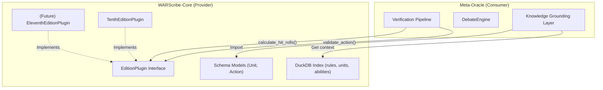
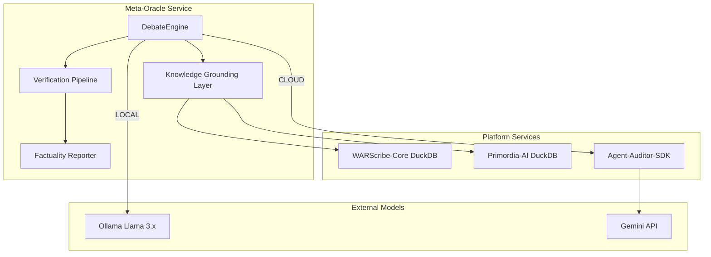

# Feature Specification: Meta-Oracle Output Quality & Correctness

**Feature Branch**: `002-name-oracle-output-quality`  
**Created**: 2026-02-05  
**Status**: Draft  
**Constitution**: [Meta-Oracle v2.8.0](file:///c:/Users/bfoxt/vindicta-platform/Meta-Oracle/.specify/memory/constitution.md)  
**Input**: Analysis of hallucinations and poor modeling in current outputs, requiring a design for correctness measurement and quality improvement.

---

## Summary

The Meta-Oracle currently produces highly speculative and often hallucinated tabletop wargaming predictions with no grounding in actual rules or stats. This feature establishes a **Correctness Framework**—a multi-layered system for grounding, verifying, and measuring the factual accuracy of predictions. It transforms the Meta-Oracle from an "interesting idea" into a **trustworthy, rules-verified prediction engine** for competitive Warhammer 40,000.

This specification covers:
1.  **Data Grounding**: Connecting agents to verified rule data via `WARScribe-Core`.
2.  **Structured Claims**: Enforcing machine-parseable outputs from all agents.
3.  **Verification Pipeline**: A dedicated `Rule-Sage` audit loop to validate claims.
4.  **Correctness Measurement**: OKRs and metrics for factuality, hallucination, and prediction accuracy.
5.  **Platform Integration**: Hooks into `Agent-Auditor-SDK`, `Primordia-AI`, and `DuckDB` for enterprise-grade operation.

---

## Objectives & Key Results (OKRs)

These OKRs define the success of this feature and are directly tied to measurable implementation outcomes.

### Objective 1: Eliminate Hallucinations in Agent Reasoning
> Ensure that all tactical claims are grounded in verifiable, indexed game rules and unit data.

| Key Result | Target | Measurement Method |
|--|--|--|
| **KR1.1**: Claim Factuality Score | > 95% Avg | Deductive Scoring (100 base, -10 hallucination, -5 stat error, -2 ambiguity) per session |
| **KR1.2**: Hallucination Rate | < 2% | % of claims referencing non-existent rules, units, or abilities |
| **KR1.3**: "DATA MISSING" Compliance | 100% | % of missing-data scenarios correctly handled vs. fabricated |

### Objective 2: Establish a Verifiable Prediction Track Record
> Provide transparent, backtestable results that users can trust.

| Key Result | Target | Measurement Method |
|--|--|--|
| **KR2.1**: Prediction Accuracy (Backtest) | > 60% | Correct outcome predictions against 50+ historical tournament results |
| **KR2.2**: Confidence Calibration | ±10% | Stated agent confidence vs. actual historical win rates for similar matchups |
| **KR2.3**: Audit Trail Coverage | 100% | Every claim traceable to a `DebateTranscript` entry with rule references |

### Objective 3: Build Enterprise-Grade Infrastructure
> The system must be robust, scalable, and cost-effective using existing platform services.

| Key Result | Target | Measurement Method |
|--|--|--|
| **KR3.1**: Test Coverage (Unit + Functional) | > 85% | Pytest + Behave coverage report |
| **KR3.2**: Token Efficiency | < 500 tokens/claim avg | Tracked via `Agent-Auditor-SDK` metrics |
| **KR3.3**: ZeroCost Operation | 100% | All operations within GCP Free Tier limits (via SDK quota management) |

---

## User Scenarios & Testing *(mandatory)*

### User Story 1 - Verifiable Rules Analysis (Priority: P0)

**Persona**: Tournament Player  
**Story**: As a tournament player, I want the Oracle agents to reference actual unit stats and abilities in their arguments so that I can trust the tactical reasoning.

**Why P0**: Foundational. Without accurate rules grounding, all predictions are functionally useless for competitive play. This is the prerequisite for all other stories.

**Independent Test**: Run a debate between Space Marines and Tyranids. Verify that every mentioned unit ability (e.g., "Oaths of Moment") is accurately described according to the indexed knowledge base.

**Acceptance Scenarios**:
1.  **Given** a Space Marine list is provided, **When** the HomeAgent makes a claim about "Eradicators," **Then** the claim must include a `RuleRef` or `UnitRef` to their "Total Obliteration" ability stats from the DuckDB knowledge base.
2.  **Given** an agent makes a mechanical claim, **When** the Rule-Sage audits the round, **Then** any claim not present in the knowledge base must be flagged as `VerificationStatus.UNVERIFIED`.
3.  **Given** a unit is not indexed in the knowledge base, **When** an agent attempts to make a claim, **Then** the claim MUST be structured with `EvidencePath: "DATA_MISSING"` and the agent MUST NOT fabricate stats.

---

### User Story 2 - Structured Evidence & Consensus (Priority: P0)

**Persona**: Platform Developer  
**Story**: As a developer, I want agents to produce structured arguments so that I can automatically calculate claim factuality and prediction accuracy.

**Why P0**: Enables the core "Correctness Measurement" framework. Without structured data, metrics are impossible.

**Independent Test**: Run the engine and verify that the `Argument` objects in the `DebateTranscript` contain structured data fields (`StructuredClaim`) instead of just raw strings.

**Acceptance Scenarios**:
1.  **Given** an agent generates a response, **When** the response is parsed, **Then** it must strictly follow the Pydantic schema for a `StructuredClaim`.
2.  **Given** a full debate transcript, **When** the validation script (`meta-oracle verify`) runs, **Then** it must output a "Factuality Report" containing the overall score and per-claim breakdowns.

---

### User Story 3 - Iterative Claim Correction (Priority: P1)

**Persona**: Platform Developer  
**Story**: As a developer, I want unverified claims to trigger a retry loop so that agents can self-correct and not be penalized for a first-try error.

**Why P1**: Directly improves the factuality score by giving agents feedback.

**Independent Test**: Force a hallucinated claim in a test. Verify the system prompts the agent to retry with specific error feedback.

**Acceptance Scenarios**:
1.  **Given** the Rule-Sage flags a claim as `UNVERIFIED`, **When** the retry limit (3) has not been reached, **Then** the system MUST re-prompt the agent with structured feedback (e.g., `"Claim for 'Frag Cannon' not found. Retry with a valid RuleRef."`).
2.  **Given** an agent fails to provide a valid claim after 3 retries, **When** the final attempt fails, **Then** the claim status MUST be set to `VerificationStatus.HALLUCINATED` and logged to the Factuality Report.

---

### User Story 4 - Structured Rule-Debate for Ambiguity (Priority: P1)

**Persona**: Tournament Organizer  
**Story**: As a tournament organizer, I want the system to explicitly flag and debate ambiguous rule interpretations so that I can see the reasoning behind contentious calls.

**Why P1**: Adds a unique, high-value layer of transparency to the prediction process.

**Independent Test**: Inject a query about an ambiguously-worded stratagem. Verify the debate pauses for a "Rule-Debate" sub-round.

**Acceptance Scenarios**:
1.  **Given** the Rule-Sage detects a claim referencing a rule with `AmbiguityFlag: true` in the knowledge base, **When** the claim is processed, **Then** the engine MUST trigger a `RuleDebateRound` sub-routine.
2.  **Given** a `RuleDebateRound` is initiated, **When** agents reach consensus (or hit a 5-exchange limit), **Then** the resolution MUST be recorded as a `RuleInterpretation` object in the transcript.

---

### User Story 5 - Factuality Dashboard & Reporting (Priority: P2)

**Persona**: Community Manager  
**Story**: As a community manager, I want a visual dashboard showing the Oracle's factuality scores over time so I can build trust with users.

**Why P2**: Enables user-facing trust-building and marketing.

**Independent Test**: Run 10 debates and verify that a human-readable report is generated and aggregated scores are correct.

**Acceptance Scenarios**:
1.  **Given** a debate session completes, **When** the `FactualityReport` is generated, **Then** it MUST be available as both embedded JSON in the `DebateTranscript` and as a standalone Markdown file.
2.  **Given** 10 debate sessions have completed, **When** the `meta-oracle report --aggregate` command runs, **Then** it MUST output a summary table with average KR1.1, KR1.2, and KR2.1 scores.

---

### User Story 6 - Integration with Primordia-AI Heuristics (Priority: P2)

**Persona**: Platform Developer  
**Story**: As a developer, I want to enrich agent claims with heuristic scores from `Primordia-AI` so that predictions are backed by both rules and tactical evaluation.

**Why P2**: Adds quantitative depth to the qualitative reasoning.

**Independent Test**: Run a debate and verify that claims about unit effectiveness include a numerical heuristic score from Primordia-AI.

**Acceptance Scenarios**:
1.  **Given** an agent is formulating a claim about unit A vs. unit B, **When** the `KnowledgeContext` is populated, **Then** it MUST request a `MatchupEvaluation` from the `Primordia-AI` DuckDB opening book.
2.  **Given** a `MatchupEvaluation` is available, **When** the claim is structured, **Then** it MUST include a `TacticalScore` field populated from Primordia.

---

### User Story 7 - Cost-Aware Debate Orchestration (Priority: P1)

**Persona**: Platform Operator  
**Story**: As a platform operator, I want all cloud model calls to be managed by the `Agent-Auditor-SDK` so that I never exceed my API quotas.

**Why P1**: Mandatory for production operation on the Gemini Free Tier.

**Independent Test**: Run a cloud-model debate with aggressive token usage. Verify that the SDK throttles or pauses the debate correctly.

**Acceptance Scenarios**:
1.  **Given** a debate is running with `ModelProvider: CLOUD`, **When** the `Agent-Auditor-SDK` detects RPM/TPM limits approaching, **Then** the `DebateEngine` MUST receive a signal to pause or slow down.
2.  **Given** daily RPD limits are exhausted, **When** a new debate is requested, **Then** the system MUST queue the request and return a `ServiceTemporarilyUnavailable` status to the caller.

---

## Requirements *(mandatory)*

### Functional Requirements

#### Component 1: Knowledge Grounding Layer

| ID       | Requirement                                                                                                                                                                                               |
| -------- | --------------------------------------------------------------------------------------------------------------------------------------------------------------------------------------------------------- |
| FR-101   | System MUST integrate read-only access to `WARScribe-Core` rules data via a shared DuckDB database (primary) or structured JSON/YAML fileshelf (secondary fallback).                                     |
| FR-102   | System MUST implement a `KnowledgeIndexer` service that indexes all competitive 10th Edition units, abilities, stratagems, and keywords from `WARScribe-Core` format into DuckDB.                        |
| FR-103   | System MUST provide a `KnowledgeContext` object, populated dynamically via Just-In-Time (JIT) RAG queries, to be injected into agent prompts during response generation.                                 |
| FR-104   | The `KnowledgeContext` MUST support filtering by faction, detachment, and unit keywords to minimize prompt size.                                                                                          |
| FR-105   | System MUST expose a `data is_indexed(unit_name: str) -> bool` function for agents to check data availability before making claims.                                                                      |

#### Component 2: Structured Claim Schema

| ID       | Requirement                                                                                                                                |
| -------- | ------------------------------------------------------------------------------------------------------------------------------------------ |
| FR-201   | All agent outputs MUST conform to a Pydantic `StructuredClaim` schema.                                                                    |
| FR-202   | The `StructuredClaim` schema MUST include: `ClaimID`, `AgentID`, `ClaimType`, `UnitRefs`, `RuleRefs`, `EvidencePath`, `TacticalScore`.    |
| FR-203   | `EvidencePath` MUST be a valid DuckDB query path or the literal `"DATA_MISSING"`.                                                          |
| FR-204   | The `Argument` class in `transcript.py` MUST be refactored to contain a list of `StructuredClaim` objects instead of a raw string.        |

#### Component 3: Verification Pipeline (Rule-Sage)

| ID       | Requirement                                                                                                                                                                                           |
| -------- | ----------------------------------------------------------------------------------------------------------------------------------------------------------------------------------------------------- |
| FR-301   | The `Rule-Sage` agent MUST verify all claims in a debate round against the DuckDB knowledge base.                                                                                                     |
| FR-302   | For each claim, the `Rule-Sage` MUST produce a `VerificationResult` object with status: `VERIFIED`, `STAT_ERROR`, `AMBIGUOUS`, `UNVERIFIED`, or `HALLUCINATED`.                                       |
| FR-303   | System MUST implement an "Iterative Correction" loop: unverified claims trigger a re-prompt to the originating agent (max 3 retries) with specific, structured error feedback.                       |
| FR-304   | If the knowledge base flags a rule as `AmbiguityFlag: true`, the system MUST trigger a "Structured Rule-Debate" sub-round before proceeding.                                                          |
| FR-305   | The `VerificationResult` schema MUST include: `ClaimID`, `Status`, `RetryCount`, `TokenUsage`, `ErrorFeedback`.                                                                                       |

#### Component 4: Factuality Reporting

| ID       | Requirement                                                                                                                                                            |
| -------- | ---------------------------------------------------------------------------------------------------------------------------------------------------------------------- |
| FR-401   | System MUST calculate a "Factuality Score" per session using Deductive Scoring: `100 - (Hallucination * 10) - (StatError * 5) - (Ambiguity * 2)`.                      |
| FR-402   | System MUST calculate a "Hallucination Rate" per session: `(Hallucinated Claims / Total Claims) * 100`.                                                                |
| FR-403   | The `FactualityReport` MUST be embedded in the `DebateTranscript` JSON under a new `quality_metrics` key.                                                              |
| FR-404   | System MUST also output the `FactualityReport` as a standalone, human-readable Markdown file alongside the JSON transcript.                                           |
| FR-405   | System MUST provide a CLI command `meta-oracle report --aggregate` to calculate rolling averages across multiple sessions.                                             |

#### Component 5: Platform Integrations

| ID       | Requirement                                                                                                                                                                         |
| -------- | ----------------------------------------------------------------------------------------------------------------------------------------------------------------------------------- |
| FR-501   | System MUST use `Agent-Auditor-SDK` for all cloud model API calls (Gemini). This includes token tracking, rate limiting (RPM/TPM), and quota persistence.                          |
| FR-502   | System MUST integrate with the `TaskQueue` from `Agent-Auditor-SDK` to manage background debate requests when foreground quota is exhausted.                                       |
| FR-503   | System MUST query `Primordia-AI` via its DuckDB opening book for `MatchupEvaluation` data to enrich agent claims with tactical scores.                                             |
| FR-504   | All integrations MUST be asynchronous (`async/await`), per Constitution V (Async-First).                                                                                           |
| FR-505   | For local development, system MUST bypass `Agent-Auditor-SDK` and use the existing `OllamaClient` for Llama 3.x models, with a clear configuration flag (`MODEL_PROVIDER=LOCAL`). |

---

### Non-Functional Requirements

| ID       | Requirement                                                                                      |
| -------- | ------------------------------------------------------------------------------------------------ |
| NFR-001  | All database operations MUST be read-only against shared DuckDB files.                            |
| NFR-002  | End-to-end debate latency (5 rounds, 5 agents) MUST be < 120 seconds on local Ollama (Llama 3.2). |
| NFR-003  | Peak memory usage for a single debate session MUST be < 2GB.                                      |
| NFR-004  | All code MUST pass `ruff` linting and `mypy --strict` type checking.                              |
| NFR-005  | Unit test coverage for core components (`engine`, `knowledge`, `verification`) MUST be >= 85%.   |

---

### Key Entities

| Entity               | Description                                                                                                                                                                                                                                             |
| -------------------- | ------------------------------------------------------------------------------------------------------------------------------------------------------------------------------------------------------------------------------------------------------- |
| `KnowledgeContext`   | Dynamic, RAG-driven subset of rules/stats retrieved during claim formulation. Filtered by faction/detachment.                                                                                                                                          |
| `StructuredClaim`    | An atomic, machine-parseable argument: `[ClaimID, AgentID, ClaimType, UnitRefs: List[str], RuleRefs: List[str], EvidencePath: str, TacticalScore: Optional[float]]`.                                                                                   |
| `VerificationResult` | Audit log entry for a single claim: `[ClaimID, Status: VerificationStatus, RetryCount: int, TokenUsage: int, ErrorFeedback: Optional[str]]`.                                                                                                           |
| `RuleInterpretation` | Record of a resolved ambiguity from a Rule-Debate: `[RuleRef, InterpretedMeaning, AgentVotes: Dict[str, str], Consensus: bool]`.                                                                                                                       |
| `FactualityReport`   | Per-session quality metrics: `[SessionID, FactualityScore: float, HallucinationRate: float, ClaimsVerified: int, ClaimsHallucinated: int, TotalTokens: int]`.                                                                                           |
| `RuleDebateRound`    | A sub-round within the main debate specifically for resolving an ambiguous rule interpretation.                                                                                                                                                         |

---

## Success Criteria *(mandatory)*

These are the go/no-go gates for the feature.

| ID      | Metric                       | Target                                                                           | Verification                                                   |
| ------- | ---------------------------- | -------------------------------------------------------------------------------- | -------------------------------------------------------------- |
| SC-001  | Claim Factuality Score       | > 95% average across 10 test sessions                                           | Automated `pytest` BDD scenario                                |
| SC-002  | Hallucination Rate           | < 2% of total claims                                                             | Automated `pytest` BDD scenario                                |
| SC-003  | Prediction Accuracy          | > 60% on 50+ historical matchups                                                 | Manual backtest script against dataset (to be sourced/created) |
| SC-004  | Confidence Calibration       | Stated confidence within ±10% of historical win rates                            | Manual backtest script                                         |
| SC-005  | Unit Test Coverage           | >= 85% for `engine.py`, `knowledge/`, `verification/`                            | CI report (`pytest-cov`)                                       |
| SC-006  | BDD Scenario Coverage        | 100% pass rate on all User Story acceptance scenarios                            | CI report (`behave`)                                           |
| SC-007  | Token Efficiency             | < 500 tokens per claim (average)                                                 | `Agent-Auditor-SDK` usage journal report                       |
| SC-008  | Zero Standing Cost           | No charges on GCP billing for Oracle operations                                  | Manual GCP billing console check                               |

---

## Edge Cases

| ID      | Scenario                             | Expected Behavior                                                                                                        |
| ------- | ------------------------------------ | ------------------------------------------------------------------------------------------------------------------------ |
| EC-001  | **Rule Ambiguity**                   | Rule-Sage MUST trigger a "Structured Rule-Debate" sub-round. Resolution recorded as `RuleInterpretation`.                |
| EC-002  | **Missing Data (Unit Not Indexed)**  | Agent MUST set `EvidencePath: "DATA_MISSING"` and NOT hallucinate stats. Claim proceeds with reduced weight.             |
| EC-003  | **Max Retries Exceeded**             | Claim status set to `HALLUCINATED`. Agent is not penalized further but round proceeds.                                  |
| EC-004  | **API Quota Exhausted (RPD)**        | `Agent-Auditor-SDK` persists remaining tasks. System returns `503 Service Unavailable` until quota resets.              |
| EC-005  | **Agent Rate Limit Hit (RPM)**       | `Agent-Auditor-SDK` applies backpressure, pausing the `DebateEngine` until safe to resume.                               |
| EC-006  | **Conflicting Agent Interpretations**| Rule-Debate round proceeds. If no consensus after 5 exchanges, Arbiter makes final call, logged as `Consensus: False`. |
| EC-007  | **Primordia-AI Data Unavailable**    | `TacticalScore` field is set to `null`. Claim proceeds without heuristic enrichment.                                     |

---

## Dependencies

| Dependency             | Version | Purpose                                            | Type      |
| ---------------------- | ------- | -------------------------------------------------- | --------- |
| `WARScribe-Core`       | >= 0.1.0 | Source for 10th Ed rules data.                     | Data      |
| `Primordia-AI`         | >= 0.1.0 | Source for opening book heuristics.                | Data      |
| `Agent-Auditor-SDK`    | >= 0.1.0 | Quota management for Gemini API calls.             | Service   |
| `DuckDB`               | latest  | Shared database for indexed knowledge.             | Infra     |
| `Pydantic`             | >= 2.0  | Data modeling and validation.                      | Library   |
| `behave`               | >= 1.2  | BDD test framework.                                | Dev       |

---

## Domain Boundaries: WARScribe-Core Integration

This section defines the precise integration surface between Meta-Oracle and WARScribe-Core's plugin model, including responsibilities, ownership, and contract guarantees.

### Integration Architecture



### Domain Ownership Table

| Concern                             | Owner              | Meta-Oracle Role      | Notes                                                                 |
| ----------------------------------- | ------------------ | --------------------- | --------------------------------------------------------------------- |
| **Unit data** (stats, abilities)    | `WARScribe-Core`   | Consumer (read-only)  | Meta-Oracle queries DuckDB; cannot modify source data.                |
| **Action validation** (legal moves) | `WARScribe-Core`   | Consumer (caller)     | Meta-Oracle calls `EditionPlugin.validate_action()` for verification. |
| **Hit roll calculation**            | `WARScribe-Core`   | Consumer (caller)     | Uses `calculate_hit_rolls()` for tactical simulations.                |
| **Edition selection**               | Meta-Oracle        | Controller            | Meta-Oracle chooses which `EditionPlugin` to instantiate per session. |
| **Claim verification logic**        | Meta-Oracle        | Owner                 | Rule-Sage verifier is Meta-Oracle's responsibility.                   |
| **Transcript format**               | Meta-Oracle        | Owner (with imports)  | Uses WARScribe's `Action` types but owns `DebateTranscript` structure.|
| **Knowledge indexing**              | Meta-Oracle        | Owner                 | DuckDB schema for rules lookup is Meta-Oracle's responsibility.       |
| **Plugin development**              | `WARScribe-Core`   | N/A                   | Meta-Oracle does NOT author edition plugins.                          |

### Contract: `EditionPlugin` Interface

Meta-Oracle consumes the following abstract interface from `WARScribe-Core`:

```python
# From warscribe.edition
class EditionPlugin(ABC):
    @property
    def edition_name(self) -> str: ...           # e.g., "10th"
    @property
    def version(self) -> str: ...                # e.g., "10.1.0"
    
    def validate_movement(self, unit: Unit, distance: int) -> bool: ...
    def validate_action(self, action: Action) -> tuple[bool, Optional[str]]: ...
    def calculate_hit_rolls(self, weapon_skill: int, target_toughness: int, modifiers: dict) -> int: ...
```

**Guarantees Expected from WARScribe-Core**:
1.  The interface is stable across minor versions.
2.  `validate_action()` returns a clear, human-readable error string on failure.
3.  The `Action` union type (`MoveAction | ShootAction | ChargeAction | FightAction`) covers all core action types.
4.  Future editions (e.g., 11th) will implement the same interface.

**Meta-Oracle Commitments**:
1.  WILL NOT subclass or modify `EditionPlugin` implementations.
2.  WILL handle `EditionPlugin` instantiation via a factory pattern keyed by `edition_name`.
3.  WILL NOT write to any WARScribe-Core data files.

### Contract: Schema Models

Meta-Oracle imports and consumes these Pydantic models from `warscribe.schema`:

| Model           | Key Fields                                                                 | Usage in Meta-Oracle                                      |
| --------------- | -------------------------------------------------------------------------- | --------------------------------------------------------- |
| `UnitReference` | `id`, `name`, `faction`, `wounds_remaining`, `models_remaining`            | Used in `StructuredClaim.unit_refs` for claim grounding.  |
| `Action`        | `actor: UnitReference`, `action_type: ActionType`, `result: ActionResult`  | Passed to `EditionPlugin.validate_action()` for audit.    |
| `ActionType`    | Enum: `MOVE`, `SHOOT`, `CHARGE`, `FIGHT`, `STRATAGEM`, `ABILITY`, etc.     | Used to categorize claims by action type.                 |

### Knowledge Base Schema (Meta-Oracle Owned)

The DuckDB knowledge base is owned by Meta-Oracle but sourced from WARScribe-Core data.

| Table         | Purpose                                        | Indexed From                |
| ------------- | ---------------------------------------------- | --------------------------- |
| `units`       | Unit profiles (name, faction, stats)           | WARScribe-Core datasheets   |
| `abilities`   | Unit and faction abilities (text, keywords)    | WARScribe-Core rules        |
| `stratagems`  | Stratagem definitions (CP cost, effect)        | WARScribe-Core rules        |
| `keywords`    | Unit keywords (e.g., INFANTRY, VEHICLE)        | WARScribe-Core datasheets   |
| `detachments` | Detachment rules and enhancements              | WARScribe-Core rules        |

**Indexing Strategy**:
- A `meta-oracle index --source <path>` command will read WARScribe-Core YAML/JSON exports and populate the DuckDB.
- This is a **batch ETL process**, not live querying.
- The DuckDB file is versioned alongside the `WARScribe-Core` source to ensure consistency.

---

## Edge Cases: WARScribe-Core Plugin Integration

| ID       | Scenario                                        | Expected Behavior                                                                                                                                                                           |
| -------- | ----------------------------------------------- | ------------------------------------------------------------------------------------------------------------------------------------------------------------------------------------------- |
| EC-WS-01 | **Plugin Not Found for Edition**                | If `edition_name` is not supported (e.g., "9th"), instantiation MUST raise `UnsupportedEditionError`. Debate cannot proceed without a valid plugin.                                       |
| EC-WS-02 | **Plugin Version Mismatch**                     | If Meta-Oracle is tested against `TenthEditionPlugin v10.1.0` but prod has `v10.2.0`, minor differences are tolerated. Major version changes (e.g., `11.0.0`) MUST trigger a config error.|
| EC-WS-03 | **Unit Not in Index (Schema vs. Index Gap)**    | If a `UnitReference.name` exists in a valid WARScribe list but is NOT in the DuckDB index, agents MUST set `EvidencePath: "INDEX_STALE"` and log a warning. This is NOT a hallucination.  |
| EC-WS-04 | **Action Type Not Validated by Plugin**         | If `validate_action()` receives a non-standard `ActionType` (e.g., `HEROIC_INTERVENTION`) that the plugin doesn't explicitly handle, it MUST return `(True, None)` (permissive default).   |
| EC-WS-05 | **Invalid `Action` Object Passed**              | If Meta-Oracle passes a malformed `Action` (e.g., missing `actor`), the plugin MUST raise a `pydantic.ValidationError`. Meta-Oracle catches this and marks the claim as `MALFORMED`.       |
| EC-WS-06 | **Modifier Key Not Recognized by Plugin**       | If `calculate_hit_rolls()` receives an unknown modifier key (e.g., `{"future_ability": true}`), the plugin SHOULD ignore it and log a warning, not fail.                                   |
| EC-WS-07 | **Concurrent Plugin Access (Thread Safety)**    | `EditionPlugin` instances are stateless and SHOULD be safe for concurrent use. Meta-Oracle MAY cache a single instance per edition per debate session.                                     |
| EC-WS-08 | **WARScribe-Core Package Unavailable**          | If `import warscribe` fails at startup, Meta-Oracle MUST raise a `DependencyMissingError` with installation instructions. Cannot proceed.                                                  |
| EC-WS-09 | **DuckDB File Locked or Corrupted**             | If the DuckDB file is inaccessible (locked, corrupted), the `KnowledgeGroundingLayer` MUST raise `KnowledgeBaseError`. Debate cannot proceed without grounding data.                       |
| EC-WS-10 | **Edition Plugin Returns Ambiguous Validation** | If `validate_action()` returns `(False, None)` (invalid without reason), Rule-Sage MUST treat this as `DISPUTED` and trigger a Rule-Debate, prompting the plugin for clarification.       |
| EC-WS-11 | **Cross-Edition Claim (Mixing Editions)**       | If a user provides lists from different editions (e.g., 10th vs. Legends), Meta-Oracle MUST reject the request with a `EditionMismatchError` before debate begins.                         |
| EC-WS-12 | **Stratagem/Ability Not in Plugin Scope**       | If an agent references a Stratagem not validated by the plugin (e.g., a custom Crusade rule), Rule-Sage MUST flag as `OUT_OF_SCOPE` rather than `HALLUCINATED`.                            |

---


This feature will be verified using the platform-standard 6-layer testing taxonomy.

| Layer         | Scope                                      | Tool                    | Target Coverage |
| ------------- | ------------------------------------------ | ----------------------- | --------------- |
| **Unit**      | Isolated functions (e.g., `deductive_score`)| `pytest`                | 90%             |
| **Component** | Single class (e.g., `KnowledgeContext`)    | `pytest`                | 85%             |
| **Functional**| Single feature (e.g., Iterative Correction)| `pytest` (BDD markers)  | 100% scenarios  |
| **Integration**| Cross-module (e.g., Engine + SDK)          | `pytest-asyncio`        | Key paths       |
| **Live**      | Real Ollama/Gemini models                  | Manual / `behave`       | Happy paths     |
| **Performance**| Latency, memory, tokens                    | `pytest-benchmark`      | NFR targets     |

---

## Architectural Overview

This section describes the high-level architecture and component interactions for the Correctness Framework.

### System Context Diagram



### Component Breakdown

1.  **DebateEngine (`engine.py`)**: The orchestrator. Manages debate rounds, agent invocations, and the retry loop.
2.  **Knowledge Grounding Layer (`knowledge/`)**: A new module containing `KnowledgeIndexer`, `KnowledgeContext`, and `RAGClient`.
3.  **Verification Pipeline (`verification/`)**: A new module containing the `RuleSageVerifier`, `IterativeCorrector`, and `RuleDebateOrchestrator`.
4.  **Factuality Reporter (`reporting/`)**: A new module containing `FactualityScorer`, `ReportGenerator`, and `AggregationService`.

### Data Flow

1.  **Debate Request** → `DebateEngine`
2.  `DebateEngine` → `KnowledgeGroundingLayer.get_context(faction_a, faction_b)`
3.  `KnowledgeGroundingLayer` ↔ **WARScribe-Core DuckDB** (JIT RAG query)
4.  `KnowledgeGroundingLayer` ↔ **Primordia-AI DuckDB** (MatchupEvaluation)
5.  `DebateEngine` → Agent (w/ `KnowledgeContext` in prompt)
6.  Agent → **LLM** (Ollama or Gemini via SDK)
7.  LLM Response → `DebateEngine` (Parsed as `List[StructuredClaim]`)
8.  `DebateEngine` → `VerificationPipeline.verify(claims)`
9.  `VerificationPipeline` → `RuleSageVerifier` (per-claim validation)
10. If `UNVERIFIED`: `IterativeCorrector.retry(claim, agent, error_feedback)` (up to 3x)
11. If `AMBIGUOUS`: `RuleDebateOrchestrator.initiate(rule_ref)`
12. `VerificationPipeline` → `FactualityReporter.record(verification_results)`
13. End of Debate → `FactualityReporter.generate_report()`
14. Report → Saved to `DebateTranscript.quality_metrics` + Standalone Markdown file

---

## Data Models (Pydantic Schemas)

### `StructuredClaim`
```python
class ClaimType(str, Enum):
    STATISTICAL = "statistical"  # e.g., "Unit X has 6 wounds"
    TACTICAL = "tactical"        # e.g., "Unit X is strong against..."
    RULE_INTERPRETATION = "rule_interpretation"
    PREDICTION = "prediction"

class StructuredClaim(BaseModel):
    claim_id: UUID = Field(default_factory=uuid4)
    agent_id: str
    claim_type: ClaimType
    text: str  # Human-readable claim text
    unit_refs: list[str] = []
    rule_refs: list[str] = []
    evidence_path: str  # DuckDB query path or "DATA_MISSING"
    tactical_score: float | None = None
```

### `VerificationResult`
```python
class VerificationStatus(str, Enum):
    VERIFIED = "verified"
    STAT_ERROR = "stat_error"
    AMBIGUOUS = "ambiguous"
    UNVERIFIED = "unverified"
    HALLUCINATED = "hallucinated"

class VerificationResult(BaseModel):
    claim_id: UUID
    status: VerificationStatus
    retry_count: int = 0
    token_usage: int = 0
    error_feedback: str | None = None
```

### `FactualityReport`
```python
class FactualityReport(BaseModel):
    session_id: UUID
    factuality_score: float
    hallucination_rate: float
    claims_verified: int
    claims_stat_error: int
    claims_ambiguous: int
    claims_hallucinated: int
    total_tokens: int
    generated_at: datetime = Field(default_factory=datetime.utcnow)
```

### `RuleInterpretation`
```python
class RuleInterpretation(BaseModel):
    rule_ref: str
    original_text: str
    interpreted_meaning: str
    agent_votes: dict[str, str]  # AgentID -> Interpretation
    consensus_reached: bool
    arbiter_decision: str | None = None
```

---

## API Contracts

### Internal Python API (`meta_oracle.engine`)

```python
async def run_debate(
    army_a: ArmyList,
    army_b: ArmyList,
    config: DebateConfig | None = None,
) -> DebateTranscript:
    """
    Runs a full adversarial debate session.

    Args:
        army_a: The first army list (structured from WARScribe).
        army_b: The second army list.
        config: Optional configuration overrides (rounds, agents, etc.).

    Returns:
        A DebateTranscript containing all rounds, claims, verification results,
        and the embedded FactualityReport.

    Raises:
        QuotaExhaustedError: If CLOUD model quota is hit and task cannot be queued.
        KnowledgeBaseError: If WARScribe-Core DuckDB is inaccessible.
    """
```

### CLI API (`meta-oracle`)

| Command                                | Description                                                             |
| -------------------------------------- | ----------------------------------------------------------------------- |
| `meta-oracle debate --list-a <file> --list-b <file>` | Run a new debate.                                                       |
| `meta-oracle verify <transcript.json>` | Re-run verification on an existing transcript.                          |
| `meta-oracle report <transcript.json>` | Generate a standalone Markdown report from a transcript.                |
| `meta-oracle report --aggregate <dir>` | Generate aggregate stats from all transcripts in a directory.           |
| `meta-oracle index --source <path>`    | Index new WARScribe-Core data into the local DuckDB knowledge base.     |

---

## Security & Trust Model

### Principles

| Principle                | Policy                                                                                                |
| ------------------------ | ----------------------------------------------------------------------------------------------------- |
| **No Secret Fabrication**| Agents MUST NOT fabricate data. Missing data triggers a `DATA_MISSING` path, not a hallucination.    |
| **Audit Trail First**    | Every claim is traceable. The `DebateTranscript` is the immutable source of truth.                   |
| **API Key Isolation**    | API keys are NEVER passed to agents. The `Agent-Auditor-SDK` handles all secrets via `SecureKeyManager`. |
| **Log Masking**          | All logs produced by the SDK (and by extension, the Oracle) MUST mask any potentially sensitive data (tokens, keys). |
| **Read-Only Data Access**| The Correctness Framework has NO write access to shared DuckDB files. It is a consumer, not a producer. |

### Threat Mitigations

| Threat                         | Mitigation                                                                                                   |
| ------------------------------ | ------------------------------------------------------------------------------------------------------------ |
| Prompt Injection via Army List | Army lists are parsed by `WARScribe-Core` *before* reaching the agent. Raw text is never injected into prompts. |
| LLM Jailbreaking               | System prompts are hardcoded and not user-modifiable. Agent personas are fixed per Constitution III.         |
| Token Exhaustion Attack        | `Agent-Auditor-SDK` enforces strict RPM/TPM limits. Retry loops are capped at 3.                              |
| Denial of Service (Debate Spam)| (Future) Rate-limiting at the API gateway level.                                                             |

---

## Rollout Plan & Milestones

This feature is estimated at **XXL** effort, requiring significant development across multiple modules.

### Phase 1: Core Infrastructure (Est. 40 hours)
- [ ] `knowledge/` module: `KnowledgeIndexer`, `KnowledgeContext`, DuckDB integration.
- [ ] `StructuredClaim` and `VerificationResult` Pydantic schemas.
- [ ] Refactor `Argument` class in `transcript.py`.
- [ ] Unit tests for all new schemas and the indexer.

### Phase 2: Verification Pipeline (Est. 35 hours)
- [ ] `verification/` module: `RuleSageVerifier`, `IterativeCorrector`.
- [ ] `RuleDebateOrchestrator` for ambiguity handling.
- [ ] Integration with `DebateEngine` for the retry loop.
- [ ] Functional (BDD) tests for all User Story acceptance scenarios.

### Phase 3: Reporting & SDK Integration (Est. 30 hours)
- [ ] `reporting/` module: `FactualityScorer`, `ReportGenerator`.
- [ ] Embed `FactualityReport` in `DebateTranscript`.
- [ ] Integrate `Agent-Auditor-SDK` for cloud model calls.
- [ ] Implement `meta-oracle report` and `meta-oracle verify` CLI commands.

### Phase 4: Primordia-AI Integration & Optimization (Est. 20 hours)
- [ ] Query `Primordia-AI` DuckDB for `MatchupEvaluation`.
- [ ] Populate `TacticalScore` in `StructuredClaim`.
- [ ] Optimize token usage per claim to meet KR3.2 target.

### Phase 5: Backtesting & Calibration (Est. 25 hours)
- [ ] Source or create a dataset of 50+ historical tournament results.
- [ ] Build backtesting script for prediction accuracy (KR2.1).
- [ ] Build calibration analysis script (KR2.2).
- [ ] Manual verification of results.

### Phase 6: Final QA & Documentation (Est. 15 hours)
- [ ] Achieve 85% test coverage.
- [ ] Verify all BDD scenarios pass.
- [ ] Write user-facing documentation for `docs/`.
- [ ] Create ADR for key architectural decisions (e.g., RAG vs. pre-indexed context).

**Total Estimated Effort: ~165 hours**

---

## Clarifications (Resolved)

- **Q1: KnowledgeContext Population**: Just-In-Time retrieval (RAG). Agents query the DuckDB knowledge base dynamically. (Resolved 2026-02-05)
- **Q2: Claim Enforcement Mechanism**: Iterative Correction with max 3 retries. Mandatory `Agent-Auditor-SDK` for cloud models. (Resolved 2026-02-05)
- **Q3: Rule Ambiguity Handling**: Structured Rule-Debate sub-round triggered by Rule-Sage. (Resolved 2026-02-05)
- **Q4: WARScribe-Core Integration Interface**: Shared DuckDB database (primary), JSON fileshelf (fallback). (Resolved 2026-02-05)
- **Q5: Factuality Scoring & Reporting**: Deductive Scoring (100 baseline). Dual output: JSON embedded + standalone Markdown. (Resolved 2026-02-05)
- **Q6: Agent Prompt Optimization**: `KnowledgeContext` will support faction/detachment filters to minimize token usage. (Auto-resolved)
- **Q7: Handling Multiple Interpretations**: Rule-Debate has a 5-exchange limit. Arbiter breaks deadlocks. (Auto-resolved)
- **Q8: Local vs. Cloud Model Switching**: `MODEL_PROVIDER` env var controls SDK bypass. Ollama for local, SDK for cloud. (Auto-resolved)
- **Q9: Token Tracking Granularity**: Tracked per-claim, aggregated per-session. Uses SDK's `UsageJournal`. (Auto-resolved)
- **Q10: `DebateTranscript` Backward Compatibility**: `Argument` class will migrate from `str` to `List[StructuredClaim]`. Old transcripts will require a migration script. (Auto-resolved)
- **Q11: Knowledge Base Schema**: DuckDB tables will follow a normalized schema: `units`, `abilities`, `stratagems`, `keywords`. (Auto-resolved)
- **Q12: Error Feedback Format**: Structured JSON passed back to agent with fields: `claim_id`, `expected_rule_ref`, `error_type`. (Auto-resolved)
- **Q13: Retry Prompt Engineering**: The retry prompt will include the failed claim text, the specific error, and a snippet of the correct rule from the knowledge base to guide the agent. (Auto-resolved)
- **Q14: Rule-Debate Logging**: All exchanges in a Rule-Debate sub-round are appended to a dedicated `rule_debates` list in the `DebateTranscript`. (Auto-resolved)
- **Q15: Aggregation Time Window**: `meta-oracle report --aggregate` will default to all-time but support `--since <date>` filtering. (Auto-resolved)

---

## Risks & Mitigations

| Risk                                                 | Likelihood | Impact  | Mitigation                                                                                                                                               |
| ---------------------------------------------------- | ---------- | ------- | -------------------------------------------------------------------------------------------------------------------------------------------------------- |
| **WARScribe-Core data is incomplete**                | High       | High    | Start with a "known good" subset (Space Marines, Tyranids, Aeldari). Expand iteratively. `DATA_MISSING` path prevents hallucination in the interim.     |
| **LLM does not reliably produce structured output**  | Medium     | High    | Enforce JSON mode in LLM calls. Implement a robust Pydantic parsing layer with fallback to raw text logging for debugging.                              |
| **Token costs exceed estimates**                     | Medium     | Medium  | Aggressive context filtering via `KnowledgeContext`. Target <500 tokens/claim. SDK provides hard limits.                                                 |
| **Rule-Debate loops indefinitely**                   | Low        | Medium  | Hard 5-exchange limit. Arbiter auto-resolves. Logged as `consensus_reached: false`.                                                                      |
| **Backtest dataset unavailable or unreliable**       | Medium     | High    | (Fallback) Use simulated matchups or crowdsource data from the Vindicta community. KR2.1 and KR2.2 may be deferred to Phase 2.                           |
| **Integration with `Agent-Auditor-SDK` has issues**  | Low        | Medium  | SDK is v0.1.0 verified. Integration tests (Layer 4) will be prioritized. Fallback to LOCAL mode for initial development.                                |

---

## Assumptions

1.  The `WARScribe-Core` DuckDB will be available and pre-populated with at least 3 factions before Phase 1 begins.
2.  The `Primordia-AI` DuckDB opening book will have basic matchup data for the target factions.
3.  The `Agent-Auditor-SDK` public API (`ArbiterScheduler`, `AITask`, `TaskQueue`) is stable and can be imported as a library.
4.  Users are comfortable with a CLI interface for initial access. A UI is out of scope for this feature.
5.  Local development will use Ollama with Llama 3.2. Cloud deployment will use Gemini 1.5 Flash.
6.  The existing `DebateEngine` and agent protocol can be extended without a full rewrite.

---

## Open Questions (To Be Resolved in Planning)

These questions should be addressed during the `speckit-plan` phase.

| ID      | Question                                                                                                             |
| ------- | -------------------------------------------------------------------------------------------------------------------- |
| OQ-001  | Should the `knowledge/` module be a separate Python package, or a subpackage within `meta_oracle`?                  |
| OQ-002  | What is the preferred DuckDB file location for shared platform data? A central `data/` directory or repo-local?      |
| OQ-003  | Should we use the `behave` library for BDD or stick to `pytest` with BDD-style markers for consistency?             |
| OQ-004  | How should old `DebateTranscript` JSON files (pre-structured claims) be handled? Migration script or graceful degradation? |
| OQ-005  | Is there a community dataset of tournament results we can use, or do we need to build one from scratch?             |

---

## Future Considerations (Out of Scope)

These items are not part of this feature but are logical next steps.

| Item                                                                | Rationale                                                                                           |
| ------------------------------------------------------------------- | --------------------------------------------------------------------------------------------------- |
| **Web UI for Factuality Dashboard**                                 | Requires `Logi-Slate-UI` or `Vindicta-Portal` integration. Defer to a dedicated UI feature.        |
| **Real-time Debate Streaming**                                      | Requires WebSocket infrastructure. Adds significant complexity.                                     |
| **User-Contributed Tournament Data**                                | Requires a data submission pipeline and moderation workflow.                                        |
| **Multi-Edition Support (9th Ed, Other Games)**                     | Requires significant `WARScribe-Core` expansion. Target 10th Edition only for now.                  |
| **Fine-Tuning a Custom Model for Tactical Reasoning**               | Requires a large dataset and fine-tuning infrastructure. Evaluate after backtest results are known. |

---

## Appendix A: Glossary

| Term                 | Definition                                                                                                |
| -------------------- | --------------------------------------------------------------------------------------------------------- |
| **Claim**            | An atomic statement made by an agent during a debate.                                                     |
| **Factuality Score** | A per-session metric measuring the percentage of claims that are verifiably correct.                     |
| **Hallucination**    | A claim that references a non-existent rule, unit, or ability.                                            |
| **Knowledge Base**   | The indexed DuckDB database containing verified game rules from `WARScribe-Core`.                         |
| **RAG**              | Retrieval-Augmented Generation. A technique where context is retrieved just-in-time to augment prompts.   |
| **Rule-Sage**        | The agent responsible for auditing claims against the knowledge base.                                     |
| **Structured Claim** | A claim formatted according to a strict Pydantic schema, enabling automated verification.                 |

---

## Appendix B: Related ADRs (To Be Created)

| ADR       | Title                                                   | Status     |
| --------- | ------------------------------------------------------- | ---------- |
| ADR-MO-001| Decision to use RAG over Pre-Indexed Context            | Proposed   |
| ADR-MO-002| Selection of DuckDB for Platform Knowledge Base         | Proposed   |
| ADR-MO-003| Adoption of `Agent-Auditor-SDK` for All Cloud API Calls | Proposed   |
| ADR-PL-001| **Rule Engine Placement: WARScribe-Core vs. Externalized**| **PENDING**|

---

## Appendix C: Architecture Decision Analysis – Rule Engine Placement

> **Status**: Open for Discussion  
> **Decision Required Before**: Phase 1 Implementation  
> **Stakeholders**: Meta-Oracle, WARScribe-Core, Platform Architecture

### Context

WARScribe-Core currently owns the `EditionPlugin` interface and reference implementations (e.g., `TenthEditionPlugin`). This means the *rules engine logic* (validation, hit calculation, action legality) lives inside WARScribe-Core.

**The Core Tension**: Should WARScribe-Core remain focused on notation/schema, while a separate "Rule Engine" service owns the plugin-based rules logic?

```
WARScribe-Core Today:
├── Notation Engine (parsing, schema)       ← Core domain
├── EditionPlugin Interface                 ← Coupled?
└── TenthEditionPlugin (rules logic)        ← Expanding domain
```

---

### Option A: Keep Rules in WARScribe-Core (Current Design)

**Philosophy**: WARScribe is the canonical source of Warhammer data; rules are inseparable from the data they validate.

| Pros | Cons |
|------|------|
| **Colocation**: Rules live with the data they reference. No import chains. | **Domain Creep**: Core expands from "notation" to "notation + rules + validation." |
| **Simplicity**: One package to install. | **Monolith Risk**: Repo grows large as editions are added. |
| **Version Coherence**: Plugin always in sync with schema. | **Cross-Consumer Coupling**: Rule changes may break notation-only consumers. |
| **Single Source of Truth**: No schema/rule drift. | **Testing Burden**: Rule and notation tests intermingled. |
| **Existing Investment**: Interface defined (PR #10). | **Contributor Friction**: New rule authors must understand entire codebase. |

**When This is Right**: Small platform, 1-2 editions, small team.

---

### Option B: Externalize Rules to a Dedicated Rule Engine

**Philosophy**: WARScribe-Core stays lean (notation/schema only). A new `WARScribe-Rules` or `Vindicta-RuleEngine` repo owns `EditionPlugin` and implementations.

| Pros | Cons |
|------|------|
| **Clean Separation**: Notation is pure; rules are pure. | **Dependency Chain**: Consumers need 2+ packages. |
| **Independent Releases**: FAQ/errata updates don't touch Core. | **Version Sync Risk**: Rule Engine may assume schema changes Core doesn't have. |
| **Focused Testing**: Isolated test suites. | **Interface Duplication**: ABC might need a shared `vindicta-interfaces` package. |
| **Parallel Development**: Rules and notation teams work independently. | **Discoverability**: Developers must learn about a second repo. |
| **Plugin Ecosystem**: Community can contribute plugins without Core access. | **Initial Effort**: Refactoring existing code and CI. |

**When This is Right**: Multiple editions, different teams, community contributions expected.

---

### Hybrid Option C: Thin Interface in Core, Implementations External

**Philosophy**: Define `EditionPlugin` ABC in WARScribe-Core (stable contract), but move all *implementations* to a separate repo.

```
warscribe-core/
├── schema/              # Unit, Action, etc.
└── edition/
    └── __init__.py      # EditionPlugin ABC only

warscribe-rules/
├── tenth.py             # TenthEditionPlugin
├── heresy.py            # HeresyEditionPlugin
└── legends.py           # LegendsEditionPlugin
```

| Pros | Cons |
|------|------|
| Stable interface in Core; implementations iterate freely. | Plugin discovery requires entry points or registry. |
| Core stays small; Rules grow independently. | Two repos to manage. |
| Clean semver: interface changes = major; rule changes = minor. | Slightly more complex imports. |

---

### Recommendation (Tentative)

Given the current state:
- **WARScribe-Core is v0.1.x** (early, schema stabilizing)
- **Only 10th Edition plugin exists** (limited scope)
- **Team is small** (1-2 developers)
- **Meta-Oracle is the first consumer**

**Defer the split.** Keep Option A through Phase 1, but add a **"Rule Engine Extraction" milestone** to the roadmap.

**Triggers for Extraction**:
1. Second edition (Horus Heresy or 11th) is actively developed.
2. WARScribe-Core exceeds 10k LOC in rules logic.
3. Community contributor requests plugin access without Core permissions.

---

### Impact on This Specification

If ADR-PL-001 resolves as **Option B or C**:

| Section | Change Required |
|---------|-----------------|
| Dependencies | Add `warscribe-rules` package. |
| Domain Ownership Table | Change `EditionPlugin` owner. |
| Edge Cases EC-WS-01, EC-WS-02 | Update error messages. |
| Rollout Phase 1 | Add task: "Import from new rules package." |

**Current Spec assumes Option A** (rules in WARScribe-Core).

---
